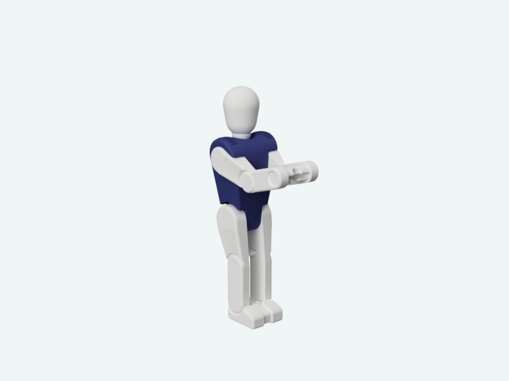
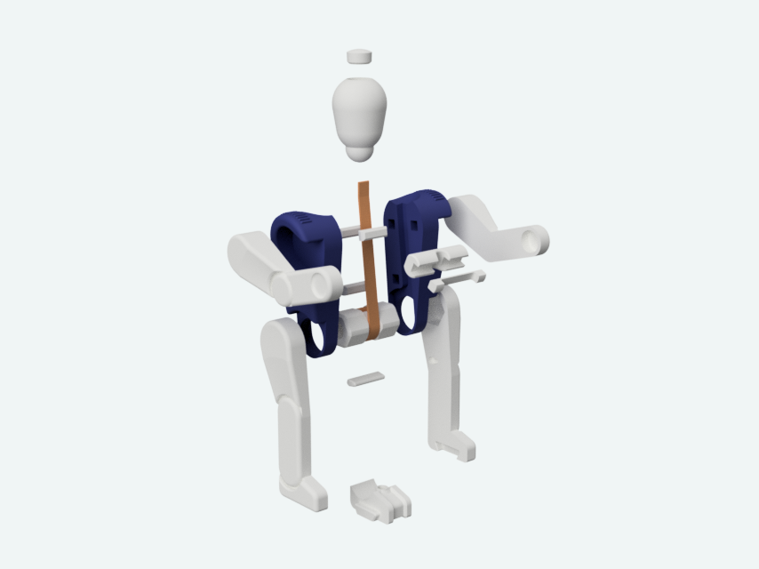

This is a fun little 3D print that might be an interesting for newcomers as well.
The design is based on the mechanical principle of a traditional wooden toy that lets the robot climb up the string if you pull on it.

More info about assembly and additional materials needed here on my blog: http://blog.mmone.de/2019/01/03/climbing-robot/

