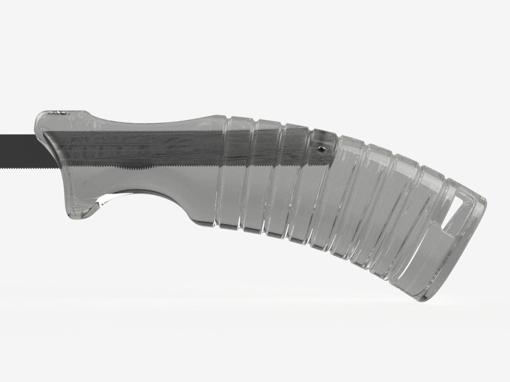
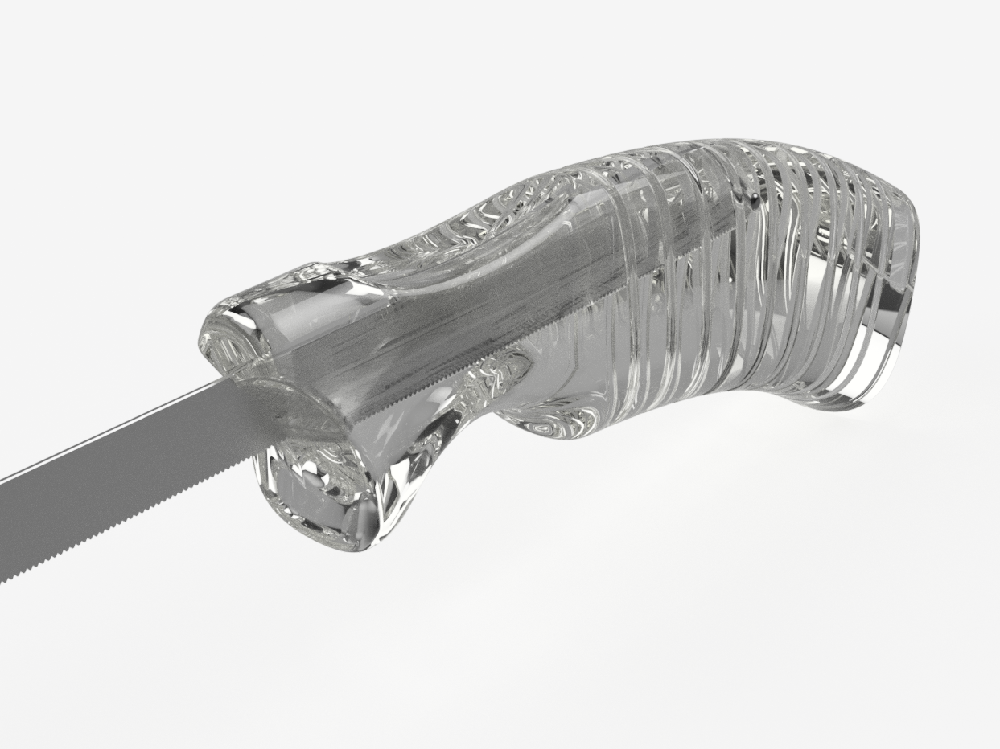

This is an ergonomic grip that accepts a standard 12mm / 1/2 inch wide metal hacksaw blade. It's very useful to get into small spaces and for flush cutoffs.
Last but not least it allows to recycle broken or partially worn blades
The blade is best mounted to cut in pull direction like a Japanese wood saw. This helps to straighten the blade while cutting.

### Part List

In addition to the printed piece you will need a ca. 3x18mm pin to lock the blade.

### Printing
The piece is best printed standing on the back as positioned in the STL. Support is not needed, only the hole at the back could use some support if you want it to look pretty.

I printed with a 0.4mm nozzle, 4 walls, 7mm cubic infill distance.

